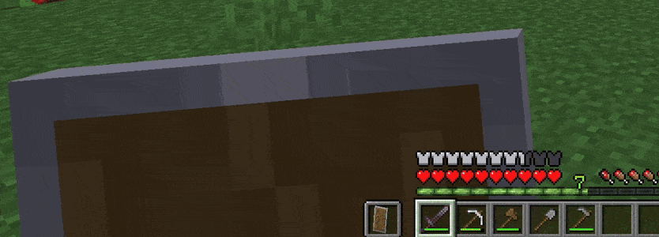

# Getting Started

## Installation
Download the mod from any of the official sources and add it into your plugins folder of your server.

## Configuration
Start your server once to generate the configuration files. Edit both the `twitch.yml` and `config.yml` files to fit your necessities. See the [configuration keys documentation](config/index.md) and [how to create events](config/events_and_actions.md).

## Setting up permissions
You will need a permission management plugin (i.e. [LuckPerms](https://luckperms.net/)).
Set all plugin permissions as you like. See [Permissions](config/permissions.md) for more information on each permission.

## Linking an account
You can link as many Twitch accounts as you like. The plugin will only listen to each account's events, so you will need to link every streamer's account.  
To link an account, simply run `/twitch link` in the console, or as any player with the `chatpointsttv.manage` permission.  
Repeat this process to link all the desired accounts.

If everything went good, you should see a success message. And from now on, all events will run the configured actions.